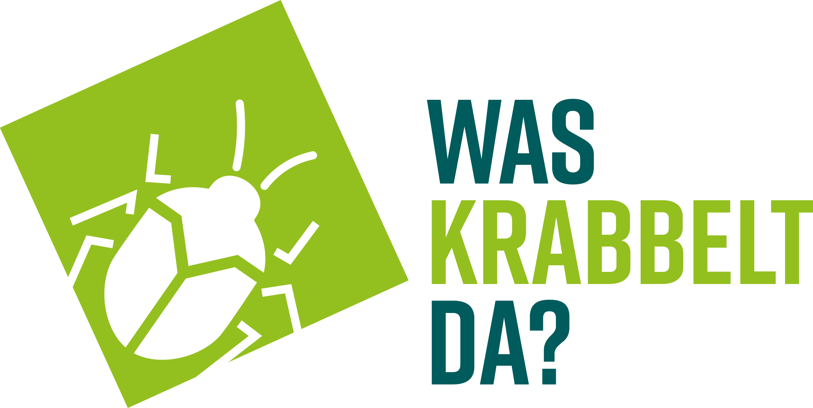

<!-- Improved compatibility of back to top link: See: https://github.com/othneildrew/Best-README-Template/pull/73 -->
<a name="readme-top"></a>

<!-- PROJECT SHIELDS -->
<!--
*** I'm using markdown "reference style" links for readability.
*** Reference links are enclosed in brackets [ ] instead of parentheses ( ).
*** See the bottom of this document for the declaration of the reference variables
*** for contributors-url, forks-url, etc. This is an optional, concise syntax you may use.
*** https://www.markdownguide.org/basic-syntax/#reference-style-links
-->
[![Contributors][contributors-shield]][contributors-url]
[![Forks][forks-shield]][forks-url]
[![Stargazers][stars-shield]][stars-url]
[![Issues][issues-shield]][issues-url]
[![MIT License][license-shield]][license-url]

<!-- PROJECT LOGO -->
<br />
<div align="center">
  <a href="https://github.com/Was-krabbelt-da/waskrabbeltda">
    
  </a>

<h3 align="center">Was krabbelt da ?</h3>

  <p align="center">
    Was krabbelt da provides journalistic tools to report on the biodiversity in your area. Based on a DIY camera trap, developed by <a href="https://github.com/maxsitt">Maximilian Sittinger</a>, this project provides a platform to automatically receive and classify the images, as well as, a dashboard to visualize and analyze the data.
    <br />
    <a href="https://github.com/Was-krabbelt-da/waskrabbeltda?tab=readme-ov-file#getting-started"><strong>Explore the docs »</strong></a>
    <br />
    <br />
    <a href="https://github.com/Was-krabbelt-da/waskrabbeltda">View Demo</a>
    ·
    <a href="https://github.com/Was-krabbelt-da/waskrabbeltda/issues/new?labels=bug&template=bug-report---.md">Report Bug</a>
    ·
    <a href="https://github.com/Was-krabbelt-da/waskrabbeltda/issues/new?labels=enhancement&template=feature-request---.md">Request Feature</a>
  </p>
</div>

<!-- TABLE OF CONTENTS -->
<details>
  <summary>Table of Contents</summary>
  <ol>
    <li>
      <a href="#about-the-project">About The Project</a>
      <ul>
        <li><a href="#built-with">Built With</a></li>
      </ul>
    </li>
    <li>
      <a href="#getting-started">Getting Started</a>
      <ul>
        <li><a href="#prerequisites">Prerequisites</a></li>
        <li><a href="#installation">Installation</a></li>
      </ul>
    <!-- </li>
    <li><a href="#usage">Usage</a></li>
    <li><a href="#roadmap">Roadmap</a></li>
    <li><a href="#contributing">Contributing</a></li> -->
    <li><a href="#license">License</a></li>
    <li><a href="#contact">Contact</a></li>
    <li><a href="#acknowledgments">Acknowledgments</a></li>
  </ol>
</details>

<!-- ABOUT THE PROJECT -->
## About The Project

[![Product Name Screen Shot][product-screenshot]](https://example.com)


<p align="right">(<a href="#readme-top">back to top</a>)</p>

### Built With

* [![FastAPI][FastAPI]][Fastapi-url]
* [![Streamlit][Streamlit]][Streamlit-url]

### Based on

* [Streamlit FastAPI Model Serving](https://github.com/davidefiocco/streamlit-fastapi-model-serving) by [Davide Fiocco](https://davidefiocco.github.io)

<p align="right">(<a href="#readme-top">back to top</a>)</p>

<!-- GETTING STARTED -->
## Getting Started

This is an example of how you may give instructions on setting up your project locally.
To get a local copy up and running follow these simple example steps.

### Prerequisites

For local development, you need to have the following installed:

* Docker: https://docs.docker.com/get-docker/

### Installation

1. Clone the repo
   ```sh
   git clone https://github.com/Was-krabbelt-da/waskrabbeltda
   ```
2. Create an API key e.g. by running the following in your command line:
    ```sh
    openssl rand -base64 128 | tr -d '\n' | pbcopy
    ```
3. Create a `.env` file in the `fastapi` folder (e.g. by copying or renaming the `.env.example` file) and fill in the created API key value. 
   ```sh
   API_KEY=
   ```
4. Create a `.env` file in the `streamlit` folder (e.g. by copying or renaming the `.env.example` file) and fill in the created API key value. You can also add a name for the camera trap which will be displayed in the dashboard and used for downloadable files. The `DATA_ENDPOINT` should be the URL of the FastAPI service, in the case of a local setup with no changes to the docker-compose file, it should be `http://fastapi:8000`.
   ```sh .env
   API_KEY=
   CAMERA_NAME=
   DATA_ENDPOINT="http://fastapi:8000"
   ```
5. Build the project with docker-compose
   ```sh
   docker compose build
   ```
6. Start the project with docker-compose
   ```sh
    docker compose up
    ```
7. Visit the FastAPI documentation of the resulting service at http://localhost:8000/docs with a web browser.
8. Visit the streamlit UI at http://localhost:8501.

You should be able to see an empty dashboard with no data (currently the dashboard displays an error if it is completely empty, send a request with mock data to the API to resolve this an be able to fix it). You can fill it by sending requests to the endpoints specified in the FastAPI documentation at http://localhost:8000/docs.

<p align="right">(<a href="#readme-top">back to top</a>)</p>

### Deployment
- 2 fly instances 
- set secrets with fly secrets
>> fastapi
fly secrets set API_KEY=... g

>> streamlit
fly secrets set API_KEY=... DATA_ENDPOINT=...

<!-- LICENSE -->
## License

Distributed under the MIT License. See `LICENSE` for more information.

<p align="right">(<a href="#readme-top">back to top</a>)</p>


<!-- CONTACT -->
## Contact

**Development:**
Theresa Hradilak - theresa.hradilak@gmail.com

**Content/Journalistic Inquiries:**
Joachim Budde - [@Joachim Budde](https://www.linkedin.com/in/joachim-budde-3296822b0/) - https://www.joachimbudde.de - ich@joachimbudde.de

**Project Webpage:** [https://waskrabbeltda.de](https://waskrabbeltda.de)

<p align="right">(<a href="#readme-top">back to top</a>)</p>

<!-- ACKNOWLEDGMENTS -->
## Acknowledgments

* [**Maximilian Sittinger**](https://github.com/maxsitt) for developing the [insect-detect camera trap](https://github.com/maxsitt/insect-detect), making it available as an open-source project and documenting it extensively [here](https://maxsitt.github.io/insect-detect-docs/), which made this project possible in the first place. And for the great support for this project.
* [**Davide Fiocco**](https://github.com/davidefiocco) for the [Streamlit FastAPI Model Serving](https://github.com/davidefiocco/streamlit-fastapi-model-serving) template that made the setup of this project a enjoyable efficient experience.
* [**Othneil Drew**](https://github.com/othneildrew) for the actual [best README template](https://github.com/othneildrew/Best-README-Template).

<p align="right">(<a href="#readme-top">back to top</a>)</p>

<!-- MARKDOWN LINKS & IMAGES -->
<!-- https://www.markdownguide.org/basic-syntax/#reference-style-links -->
[contributors-shield]: https://img.shields.io/github/contributors/Was-krabbelt-da/waskrabbeltda.svg?style=for-the-badge
[contributors-url]: https://github.com/Was-krabbelt-da/waskrabbeltda/graphs/contributors
[forks-shield]: https://img.shields.io/github/forks/Was-krabbelt-da/waskrabbeltda.svg?style=for-the-badge
[forks-url]: https://github.com/Was-krabbelt-da/waskrabbeltda/network/members
[stars-shield]: https://img.shields.io/github/stars/Was-krabbelt-da/waskrabbeltda.svg?style=for-the-badge
[stars-url]: https://github.com/Was-krabbelt-da/waskrabbeltda/stargazers
[issues-shield]: https://img.shields.io/github/issues/Was-krabbelt-da/waskrabbeltda.svg?style=for-the-badge
[issues-url]: https://github.com/Was-krabbelt-da/waskrabbeltda/issues
[license-shield]: https://img.shields.io/github/license/Was-krabbelt-da/waskrabbeltda.svg?style=for-the-badge
[license-url]: https://github.com/Was-krabbelt-da/waskrabbeltda/blob/master/LICENSE.txt
[product-screenshot]: assets/screenshot.png
[FastAPI]: https://img.shields.io/badge/FastAPI-005571?style=for-the-badge&logo=fastapi
[Fastapi-url]: https://fastapi.tiangolo.com
[Streamlit]: https://img.shields.io/badge/-Streamlit-61DAFB?style=plastic&logo=streamlit
[Streamlit-url]: https://streamlit.io